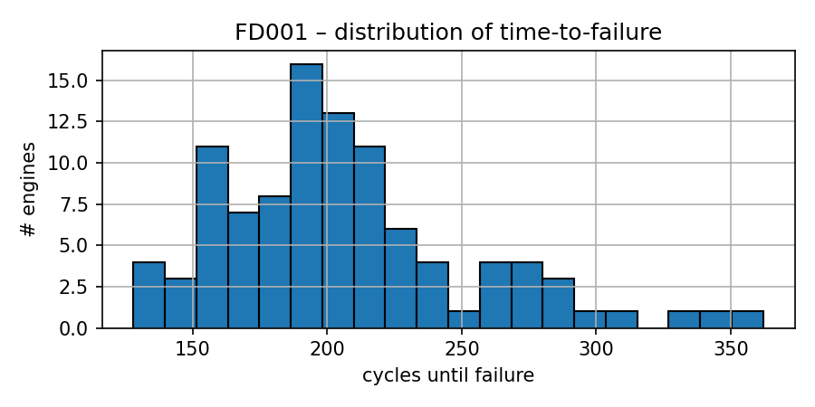
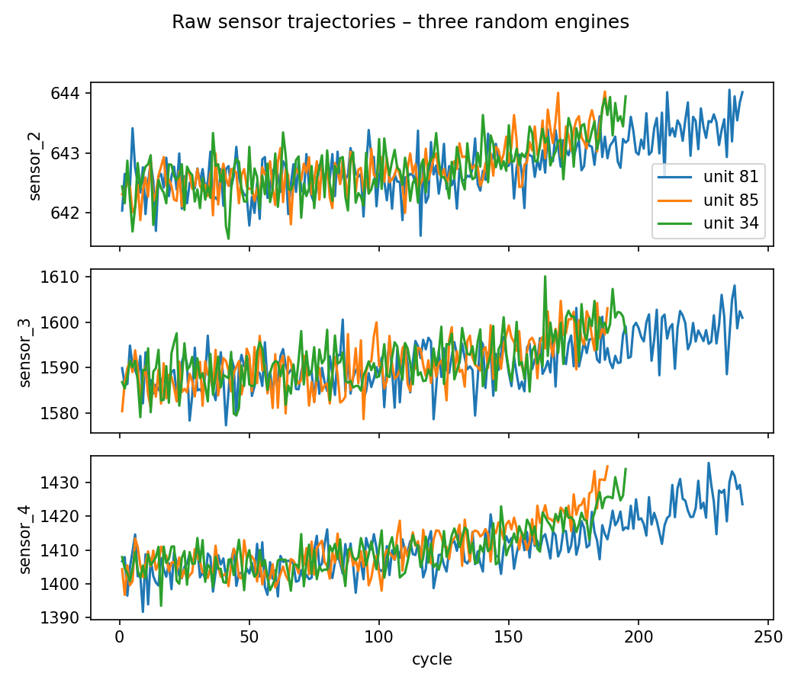
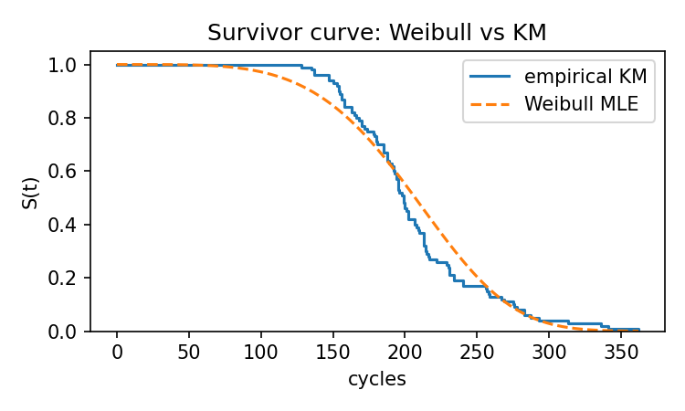
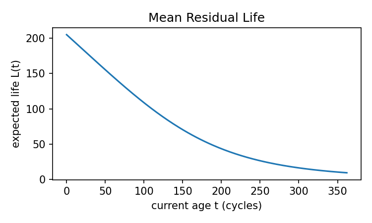
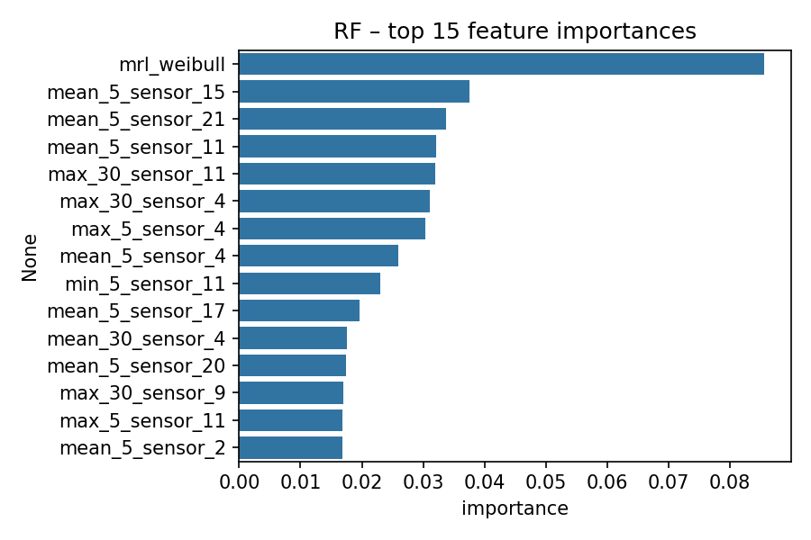
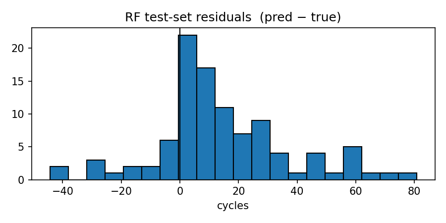

# Turbofan Engine Remaining Useful Life Prediction (FD001)

> *Reliability Engineering & Machine Learning*

---

# 1. Project Overview

Predict the **Remaining Useful Life (RUL)** of turbofan engines from the NASA C-MAPSS dataset using a hybrid:
- **Reliability modeling** (Weibull distribution, Mean Residual Life)
- **Machine Learning** (Random-Forest and XGBoost regressors)

This enables **predictive maintenance** before failure.

---

# 2. Final Directory Structure

```
turbofan-rul/
├── data/
│   ├── processed/           # (currently unused)
│   └── raw/FD001–FD004/      # NASA run-to-failure datasets
│       └── RUL, train, test files
├── models/                  # Saved ML models
│   ├── rf_fd001.joblib
│   └── xgb_fd001.json
├── notebooks/               # Jupyter analysis
│   ├── 01_eda_fd001.ipynb
│   └── 03_figures_fd001.ipynb
├── reports/                 # Predictions + final figures
│   ├── rf_fd001_predictions.csv
│   ├── xgb_fd001_predictions.csv
│   └── figures/
│       ├── lifetime_hist.png
│       ├── sensor_traces.png
│       ├── survivor_fit.png
│       ├── mrl_curve.png
│       ├── rf_feat_imp.png
│       └── err_hist.png
├── src/turbofan/             # Core pipeline
│   ├── data_loading.py
│   ├── features.py
│   ├── reliability.py
│   ├── eval.py
│   ├── train_xgb.py
│   └── __init__.py
└── README.md                 # (this file)
```

---

# 3. Problem Formulation

**Given:** noisy sensor streams from multiple engines until failure.

**Predict:** Remaining Useful Life (RUL) — cycles left until failure — for each engine in the test set.

---

# 4. Workflow Summary

### Step 1: Understand degradation patterns
- Sensor data shows small drifts masked by noise.
- Lifetime varies between ~130–350 cycles.

### Step 2: Model reliability baseline
- Fit a two-parameter **Weibull** distribution to engine lifetimes.
- Compute **Mean Residual Life** \( L(t) \) for each engine based on its age.

**Weibull Survivor Function:**

$$
S(t) = e^{ -(\frac{t}{\lambda})^\kappa}
$$

---

**Mean Residual Life (MRL) Function:**

$$
L(t) = \frac{\int_t^\infty S(u) \, du}{S(t)} - t
$$

### Step 3: Engineer rolling features
- For each sensor: moving averages, minima, maxima, standard deviations (5 and 30-cycle windows).
- Add age, settings, and Weibull MRL as input features.

### Step 4: Machine learning models
- Train a **Random-Forest** and an **XGBoost** regressor on the feature matrix.
- Tune hyperparameters lightly (n_estimators, max_depth, learning_rate).

### Step 5: Evaluation
- Metrics:
  - **MAE**: Mean Absolute Error
  - **RMSE**: Root Mean Square Error
  - **PHM08 Score**: Penalty-heavy metric from the PHM 2008 Challenge


# 5. Key Figures (Detailed)

### **A) Lifetime distribution**



**What it shows:**
- Number of engines surviving to different lifetimes.
- Peak around 170–220 cycles.

**Why it matters:**
- Sets the scale of typical engine life.
- Shows natural variation and motivates statistical modeling.

**Decision:**
✅ Expect failure most commonly between 170–220 cycles.

---

### **B) Sensor drift examples**



**What it shows:**
- Sensor readings for three engines over their lifetime.

**Why it matters:**
- Shows subtle, noisy drifts in sensor values.
- Indicates need for rolling/statistical feature engineering.

**Decision:**
✅ Engineer moving averages, maxima, minima.

---

### **C) Survivor curve: Weibull vs Kaplan-Meier**



**What it shows:**
- Fitted Weibull survival curve over empirical survival curve.

**Why it matters:**
- Shows Weibull fits reasonably well — imperfect but strong starting point.

**Decision:**
✅ Use Weibull \( S(t) \) and derive \( L(t) \) for modeling and features.

---

### **D) Mean Residual Life (MRL) curve**



**What it shows:**
- Expected remaining life based on engine age.

**Why it matters:**
- Natural decline; strong scalar feature indicating health.

**Decision:**
✅ Include Weibull MRL as a major feature in ML models.

---

### **E) Random-Forest feature importances**



**What it shows:**
- Top 15 most impactful features.

**Why it matters:**
- Confirms that MRL and engineered rolling sensor features dominate.

**Decision:**
✅ Trust feature engineering pipeline.

---

### **F) RF test-set residuals**



**What it shows:**
- Histogram of prediction errors.

**Why it matters:**
- Errors are centered and symmetric; no large systematic bias.

**Decision:**
✅ RF model is acceptable and reliable.

---

# 6. Results Summary

| Model | MAE (cycles) | RMSE (cycles) | 
|------|-------------:|--------------:|
| Weibull MRL baseline | 45.2 | 48.8 | 
| **Random-Forest (final)** | **19.3** | **26.8** | 
| XGBoost (basic) | 20.6 | 28.8 | 

---

# 7. How to Reproduce

```bash
# Clone the repo and enter
cd turbofan-rul

# Setup venv
python -m venv .venv
.venv\Scripts\activate
pip install -r requirements.txt

# Train Random-Forest
python -m turbofan.train_rf

# Predict and evaluate in notebook
jupyter notebook notebooks/01_eda_fd001.ipynb

# (Optional) Train XGBoost
python -m turbofan.train_xgb
```

---


# 9. References

- Saxena, Goebel, Simon, Eklund — "Damage Propagation Modeling for Aircraft Engine Run-to-Failure Simulation", *PHM 2008*.
- XGBoost documentation 3.0 — training API and early stopping.
- Lifelines package — Kaplan-Meier estimator and survival analysis tools.

---

> 2025 — Final Reliability Engineering Project — Marouf Paul & Team 🚀

